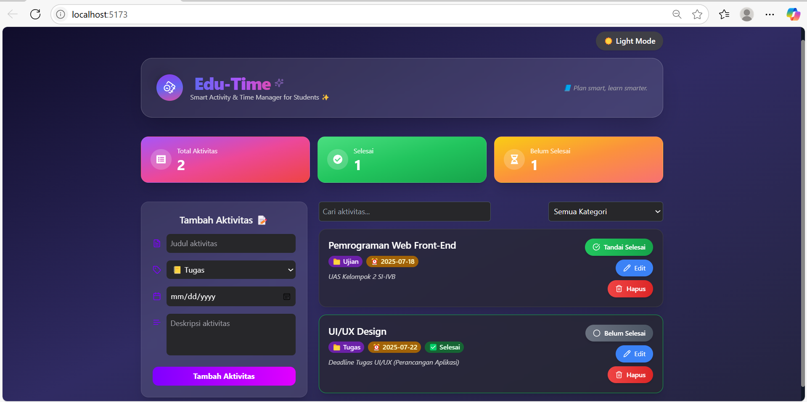
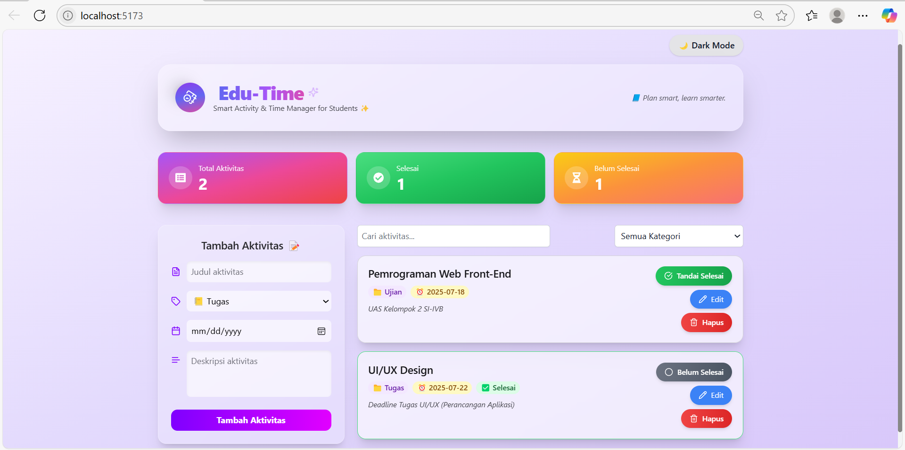
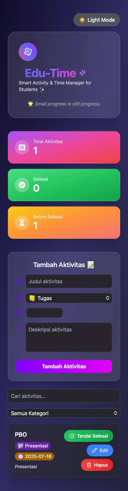
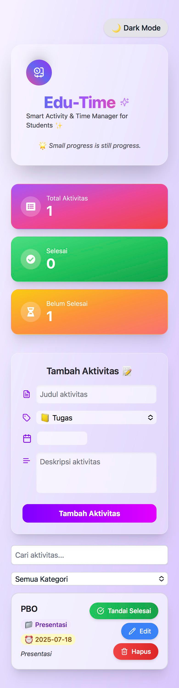

# 🎓 Edu-Time – Smart Activity & Time Manager for Students

Aplikasi manajemen tugas dan aktivitas mahasiswa berbasis web, modern, profesional, dan interaktif. Dibuat dengan React + TailwindCSS + Vite, lengkap dengan fitur CRUD, pencarian real-time, dan animasi.  

---

## 👨‍👩‍👧‍👦 Kelompok 2 – Kelas SI-IVB

| NIM           | Nama               |
|---------------|--------------------|
| 230660221018  | Intan Kartika      |
| 230660221030  | Syifa Nur Insani   |
| 230660221094  | Kikania Zahra      |
| 230660221113  | Muhammad Andre     |

---  
🔗 **Link:** [Lihat Aplikasinya di Netlify](https://uas-kelompok2-4b.netlify.app)

## ✨ Fitur Utama

- ✅ **CRUD Lengkap** (Create, Read, Update, Delete)
- 🔎 **Filter & Search** real-time
- 📂 Kategori aktivitas (Tugas, Ujian, Rapat, dll)
- 🌗 Dark/Light Mode
- 🧠 Status indikator selesai/belum
- 🎨 Desain dengan **animasi teks & logo interaktif**
- 💾 Konfirmasi sebelum menghapus
- 📱 Responsive & user friendly

---

## 📸 Tampilan Aplikasi

### 💻 Dark Mode (Desktop) 


### ☀️ Light Mode (Desktop) 
  

### 💻 Dark Mode (Mobile) 
  

### ☀️ Light Mode (Mobile) 
  

---

## 📚 Contoh Struktur Data

```js
{
  id: 1,
  title: "Judul Aktivitas",
  category: "Tugas",
  deadline: "2025-07-20",
  description: "Deskripsi Tugas",
  isDone: false
}

uas-kelompok2-4b/
├── public/
├── src/
│   ├── assets/           # Gambar
│   ├── components/       # Semua komponen UI
│   │   ├── ActivityForm.jsx
│   │   ├── ActivityItem.jsx
│   │   ├── ActivityList.jsx
│   │   ├── FilterBar.jsx
│   │   ├── SearchBar.jsx
│   │   └── StatsBox.jsx
│   ├── pages/
│   │   └── Home.jsx      # Tampilan Utama
│   ├── App.css           
│   ├── App.jsx           # State utama & handler CRUD
│   ├── index.css           
│   └── main.jsx          # Root render React
├── README.md
├── package.json
├── postcss.config.js
├── tailwind.config.js
└── vite.config.js
